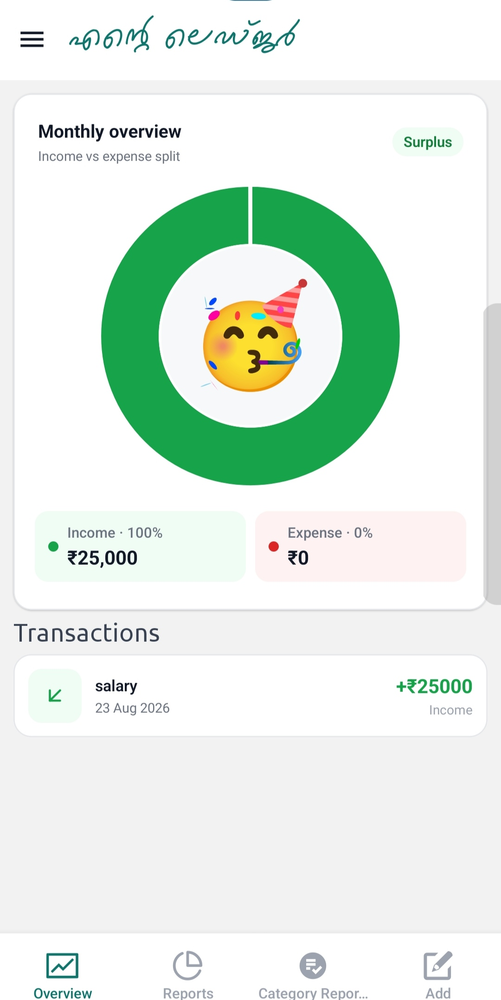
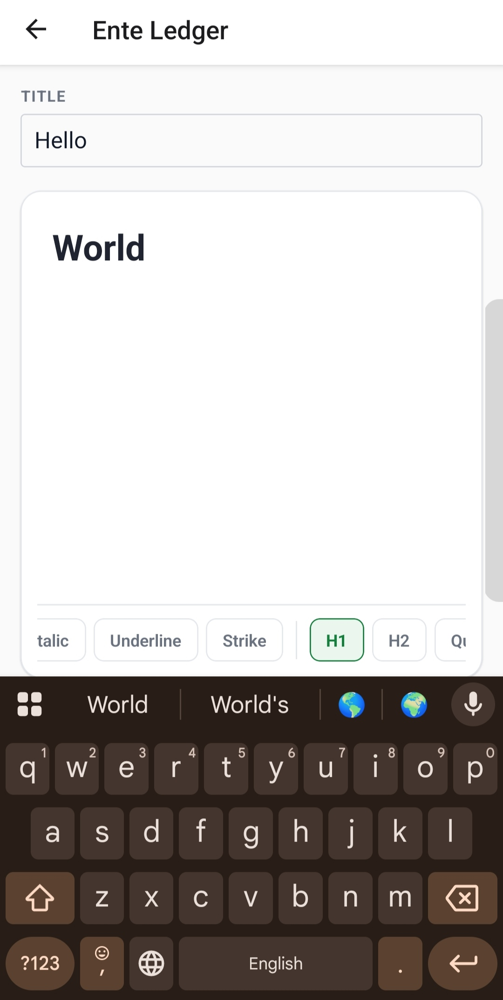

# Ente Ledger

> A modern, offline-first personal ledger application built with React Native, Expo, TypeScript, and WatermelonDB.

Ente Ledger is a mobile ledger application designed for **fast, reliable, and offline-first financial record management**. It allows users to track income and expenses, organize transactions into categories, monitor balances, and manage financial records using a high-performance local database.

The application is built with **React Native and Expo** and uses **WatermelonDB with SQLite** for efficient local data storage and reactive database updates.

---

## ✨ Features

- 💰 **Income & Expense Tracking**
- 📒 **Personal Ledger Management**
- 🗂️ **Transaction Categories**
- 🔎 **Search & Filtering**
- 📊 **Reports & Analytics**
- ⚡ **Offline-First Architecture**
- 🚀 **High-Performance Database**
- 🔄 **Reactive Data Updates**
- 📱 **Modern Mobile UI**
- 🔐 **Local Data Storage**

---

## 🛠️ Technology Stack

| Technology                 | Purpose                                     |
| -------------------------- | ------------------------------------------- |
| React Native               | Cross-platform mobile application framework |
| Expo                       | Development and build platform              |
| TypeScript                 | Type-safe application development           |
| WatermelonDB               | High-performance reactive database          |
| SQLite                     | Local database storage                      |
| Expo Router                | File-based navigation                       |
| Gluestack UI               | UI component library                        |
| NativeWind                 | Utility-first styling                       |
| FlashList                  | High-performance list rendering             |
| React Native Reanimated    | Animations                                  |
| Day.js                     | Date and time handling                      |
| Lottie                     | Animations                                  |
| Lucide React Native        | Icons                                       |
| React Native Gifted Charts | Charts and analytics                        |

---

## 🏗️ Architecture

Ente Ledger follows an **offline-first architecture** where the local database acts as the primary source of application data.

```text
┌──────────────────────────────────┐
│         React Native UI          │
│     Gluestack UI / NativeWind    │
├──────────────────────────────────┤
│        Application Logic         │
│       Hooks / Services / Utils   │
├──────────────────────────────────┤
│           WatermelonDB           │
│      Reactive Database Layer     │
├──────────────────────────────────┤
│              SQLite              │
│          Local Storage           │
└──────────────────────────────────┘
```

### Benefits

- Fast database operations
- Works without an internet connection
- Reliable local data persistence
- Reactive database updates
- Efficient handling of large transaction histories
- Smooth mobile experience

---

## 📂 Project Structure

```text
ente-ledger/
├── app
│   ├── (drawer)
│   │   ├── (home)
│   │   │   ├── _layout.tsx
│   │   │   ├── categoryReports.tsx
│   │   │   ├── index.tsx
│   │   │   ├── newEntry.tsx
│   │   │   └── reports.tsx
│   │   ├── _layout.tsx
│   │   ├── aboutDrawer.tsx
│   │   ├── categoriesDrawer.tsx
│   │   ├── categoryReportsDrawer.tsx
│   │   ├── notesDrawer.tsx
│   │   ├── reportDrawer.tsx
│   │   └── settingsDrawer.tsx
│   ├── components
│   │   ├── categoryFList.tsx
│   │   ├── datepicker.tsx
│   │   ├── drawerHeader.tsx
│   │   ├── dropdown.tsx
│   │   ├── filterButtons.tsx
│   │   ├── filterContainer.tsx
│   │   ├── formController.tsx
│   │   ├── input.tsx
│   │   ├── inputArea.tsx
│   │   ├── list.tsx
│   │   ├── overviewCard.tsx
│   │   ├── pieChart.tsx
│   │   ├── printContainer.tsx
│   │   ├── radioBtn.tsx
│   │   ├── spinner.tsx
│   │   ├── summeryCard.tsx
│   │   └── transactionContainer.tsx
│   ├── dev
│   │   ├── DevPanel.tsx
│   │   ├── db.ts
│   │   └── test.tsx
│   ├── hoc
│   │   ├── withAnimation.jsx
│   │   └── withObservebile.tsx
│   ├── hooks
│   │   ├── useError.ts
│   │   ├── useFormKey.ts
│   │   └── useTransactionForm.ts
│   ├── modules
│   │   ├── (noteEditor)
│   │   │   └── [id].tsx
│   │   ├── (noteViewer)
│   │   │   └── [id].tsx
│   │   ├── (transactionEditor)
│   │   │   └── [id].jsx
│   │   ├── Categories.jsx
│   │   ├── about.tsx
│   │   ├── categoryReports.tsx
│   │   ├── notes.tsx
│   │   ├── reports.tsx
│   │   ├── settings.tsx
│   │   └── transactionForm.tsx
│   ├── styles
│   │   └── reset.ts
│   └── _layout.tsx
├── assets
│   ├── fonts
│   │   ├── malayalam
│   │   │   ├── Chilanka-Regular.ttf
│   │   │   └── Karumbi-Regular.ttf
│   │   └── ubuntu
│   │       ├── Ubuntu-Bold.ttf
│   │       ├── Ubuntu-BoldItalic.ttf
│   │       ├── Ubuntu-Italic.ttf
│   │       ├── Ubuntu-Light.ttf
│   │       ├── Ubuntu-LightItalic.ttf
│   │       ├── Ubuntu-Medium.ttf
│   │       ├── Ubuntu-MediumItalic.ttf
│   │       └── Ubuntu-Regular.ttf
│   ├── images
│   │   ├── android-icon-background.png
│   │   ├── android-icon-foreground.png
│   │   ├── android-icon-monochrome.png
│   │   ├── favicon.png
│   │   ├── icon.png
│   │   ├── iconG.png
│   │   ├── partial-react-logo.png
│   │   ├── react-logo.png
│   │   ├── react-logo@2x.png
│   │   ├── react-logo@3x.png
│   │   ├── spashG.png
│   │   └── splash-icon.png
│   └── lottie
│       ├── bee.json
│       ├── fingerprint.json
│       ├── orangutan.json
│       ├── partyFace.json
│       ├── sad.json
│       └── time-not-done.json
├── components
│   └── ui
│       ├── avatar
│       │   └── index.tsx
│       ├── box
│       │   ├── index.tsx
│       │   ├── index.web.tsx
│       │   └── styles.tsx
│       ├── button
│       │   └── index.tsx
│       ├── card
│       │   ├── index.tsx
│       │   ├── index.web.tsx
│       │   └── styles.tsx
│       ├── form-control
│       │   └── index.tsx
│       ├── gluestack-ui-provider
│       │   ├── config.ts
│       │   ├── index.next15.tsx
│       │   ├── index.tsx
│       │   ├── index.web.tsx
│       │   └── script.ts
│       ├── heading
│       │   ├── index.tsx
│       │   ├── index.web.tsx
│       │   └── styles.tsx
│       ├── hstack
│       │   ├── index.tsx
│       │   ├── index.web.tsx
│       │   └── styles.tsx
│       ├── icon
│       │   ├── index.tsx
│       │   └── index.web.tsx
│       ├── input
│       │   └── index.tsx
│       ├── link
│       │   └── index.tsx
│       ├── modal
│       │   └── index.tsx
│       ├── popover
│       │   └── index.tsx
│       ├── radio
│       │   └── index.tsx
│       ├── select
│       │   ├── index.tsx
│       │   └── select-actionsheet.tsx
│       ├── text
│       │   ├── index.tsx
│       │   ├── index.web.tsx
│       │   └── styles.tsx
│       ├── textarea
│       │   └── index.tsx
│       ├── toast
│       │   └── index.tsx
│       └── vstack
│           ├── index.tsx
│           ├── index.web.tsx
│           └── styles.tsx
├── screenShots
├── src
│   ├── auth
│   │   └── index.ts
│   ├── db
│   │   ├── migration
│   │   │   └── migrations.ts
│   │   ├── model
│   │   │   ├── category.ts
│   │   │   ├── notes.ts
│   │   │   └── transaction.ts
│   │   ├── schema
│   │   │   └── schema.ts
│   │   ├── seeds
│   │   │   ├── initialData.ts
│   │   │   └── seeder.ts
│   │   ├── database.native.ts
│   │   └── database.web.ts
│   ├── types
│   │   └── index.ts
│   └── utils
│       ├── date
│       │   └── getCalender.ts
│       ├── db
│       │   ├── repository
│       │   │   ├── categoryRepository.ts
│       │   │   ├── notesRepository.ts
│       │   │   └── txnRepository.ts
│       │   └── services
│       │       ├── notesService.ts
│       │       ├── reportService.ts
│       │       └── transactionService.ts
│       ├── print
│       │   ├── genarateHtml.ts
│       │   └── printer.ts
│       ├── storage
│       │   └── storageService.ts
│       └── validator
│           ├── formValidator.ts
│           ├── formateInputs.ts
│           └── noteValidator.ts
├── .gitignore
├── .npmrc
├── README.md
├── app.config.js
├── babel.config.js
├── cspell.json
├── eas.json
├── eslint.config.js
├── global.css
├── metro.config.js
├── nativewind-env.d.ts
├── package-lock.json
├── package.json
├── tailwind.config.js
├── test.js
└── tsconfig.json
```

> The project structure may evolve as new features and modules are introduced.

---

# 🚀 Getting Started

## Prerequisites

Make sure you have the following installed:

- [Node.js](https://nodejs.org/)
- npm
- Git
- Android Studio
- Android SDK
- Java Development Kit (JDK)

For iOS development, a macOS environment with Xcode is required.

---

## 📥 Installation

Clone the repository:

```bash
git clone https://github.com/Azharkoivila/Ente-Ledger
```

Navigate to the project:

```bash
cd ente-ledger
```

Install dependencies:

```bash
npm install
```

---

## ▶️ Start Development

Start the Expo development server:

```bash
npm start
```

Or:

```bash
npx expo start
```

### Android

```bash
npm run android
```

### iOS

```bash
npm run ios
```

### Web

```bash
npm run web
```

---

# 📦 Android Builds

Ente Ledger provides dedicated scripts for generating development, production, and ARMv7 Android APKs.

## Development APK

```bash
npm run apk:dev
```

This uses the development application variant and generates a debug APK.

## Production APK

```bash
npm run apk:re
```

This uses the production application variant and generates a release APK.

---

# 🧹 Code Quality

Run ESLint:

```bash
npm run lint
```

---

# 🗄️ Database

Ente Ledger uses **WatermelonDB** with **SQLite** for local data persistence.

WatermelonDB provides an efficient and reactive database layer suitable for applications with large amounts of local data.

### Database capabilities

- Reactive queries
- Efficient database operations
- Offline data access
- SQLite-backed persistence
- Observable data updates
- Scalable transaction management

A simplified transaction structure:

```text
Look DB SCHEMAS
```

---

# 🔒 Data & Privacy

Ente Ledger follows a **local-first approach**.

Financial records are stored locally on the device using SQLite through WatermelonDB. Core ledger functionality does not require an internet connection.

> Cloud synchronization and additional backup functionality may be introduced in future versions.

---

# 🗺️ Roadmap

## Core Features

- [x] Income tracking
- [x] Expense tracking
- [x] Categories
- [x] Transaction history
- [x] Balance tracking
- [x] Local SQLite database
- [x] WatermelonDB integration
- [x] Offline-first architecture
- [x] FingerPrint/PassWord Authentication
- [x] Category analytics
- [x] Monthly summaries
- [x] filtering

## Analytics

- [x] Financial charts

## Data Management

- [ ] Data export
- [ ] Database backup
- [ ] Database restore
- [ ] Import/export support

## Synchronization

- [ ] Cloud synchronization
- [ ] Multi-device synchronization

---

---

## 📱 Screenshots

### Home

<p align="center">
  
</p>

### Reports

<p align="center">
  
</p>

### CategoryReports

<p align="center">
  
</p>

### CategoryList

<p align="center">
  
</p>

### NoteEditor

<p align="center">
  
</p>
# 🤝 Contributing

Contributions are welcome!

If you would like to contribute to Ente Ledger:

### 1. Fork the repository

Create your own fork of the project.

### 2. Clone your fork

```bash
git clone https://github.com/Azharkoivila/Ente-Ledger
cd ente-ledger
```

### 3. Create a feature branch

```bash
git checkout -b feature/my-new-feature
```

### 4. Make your changes

Implement your feature or fix.

### 5. Run linting

```bash
npm run lint
```

### 6. Commit your changes

```bash
git commit -m "feat: add my new feature"
```

### 7. Push your branch

```bash
git push origin feature/my-new-feature
```

### 8. Open a Pull Request

Create a Pull Request describing your changes.

---

# 📄 License

This project is licensed under the **MIT License**.

See the `LICENSE` file for more information.

---

# ⭐ Support

If you find **Ente Ledger** useful, consider giving the repository a ⭐ on GitHub.

Feedback, bug reports, feature requests, and contributions are always welcome.

---

**Ente Ledger**

Built with ❤️ using **React Native · Expo · TypeScript · WatermelonDB**
